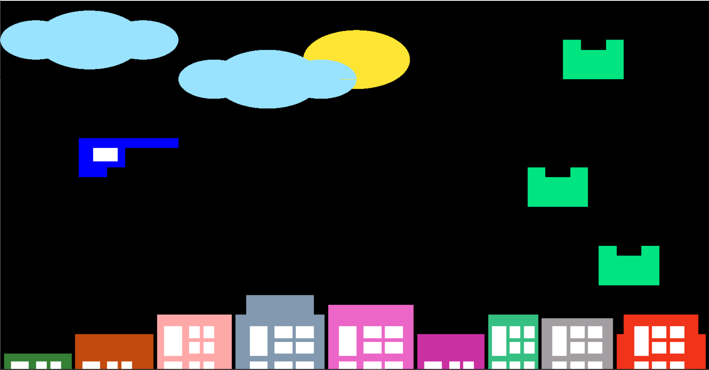
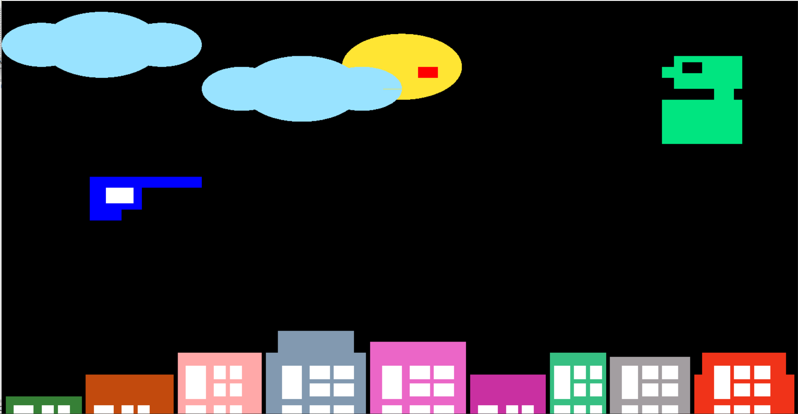
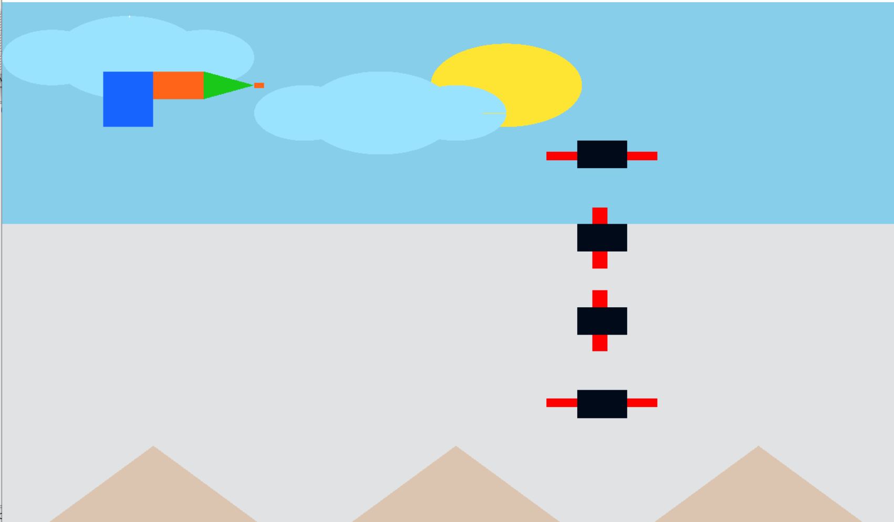

# DEADLY_MONSTERS

Deadly Monsters is a game which is built by using opengl. It has three levels where each level has two types of monsters. 
Firstly, shooter has to shoot the small monsters and then after killing all the small monsters shooter will have to defeat the "Big Monster" which is very powerful and also shots back the shooter. If the shooter get shot by the "Big Monster", the game will be ove and the score will be shown. If the shooter can defeat the "Big Monster", he will be able to go to another level. After defeating the last level's "Big Monster", the shooter will be congratulated and the score will be shown on the screen.
 

Here is the welcome page of Desdly Monsters. Instructions of playing game is given here

This is level one where small monsters are shown. It's background is black and there are many buildings in it. Small green monsters are going to attack the shooter.

